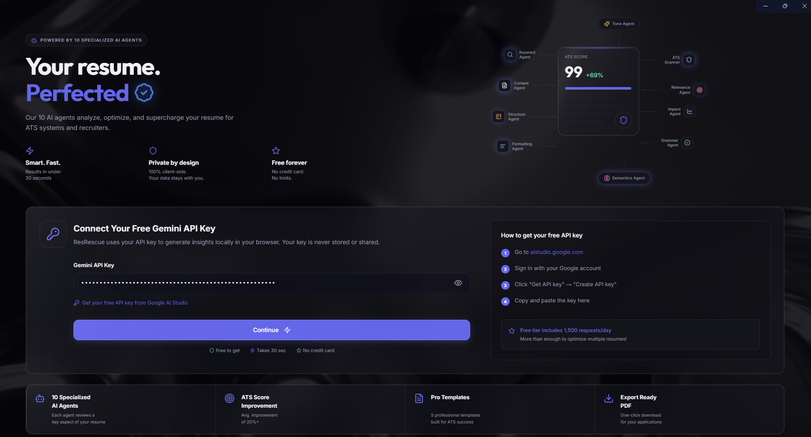
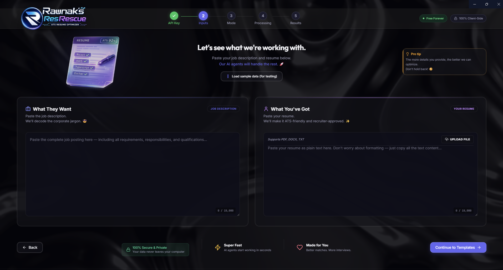
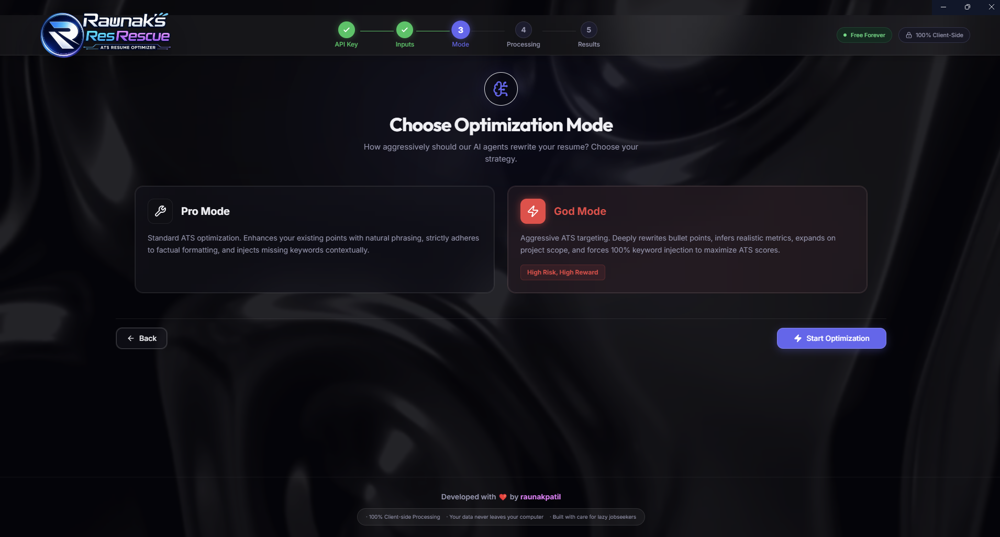
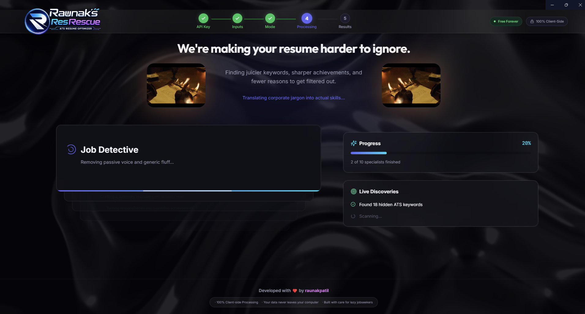
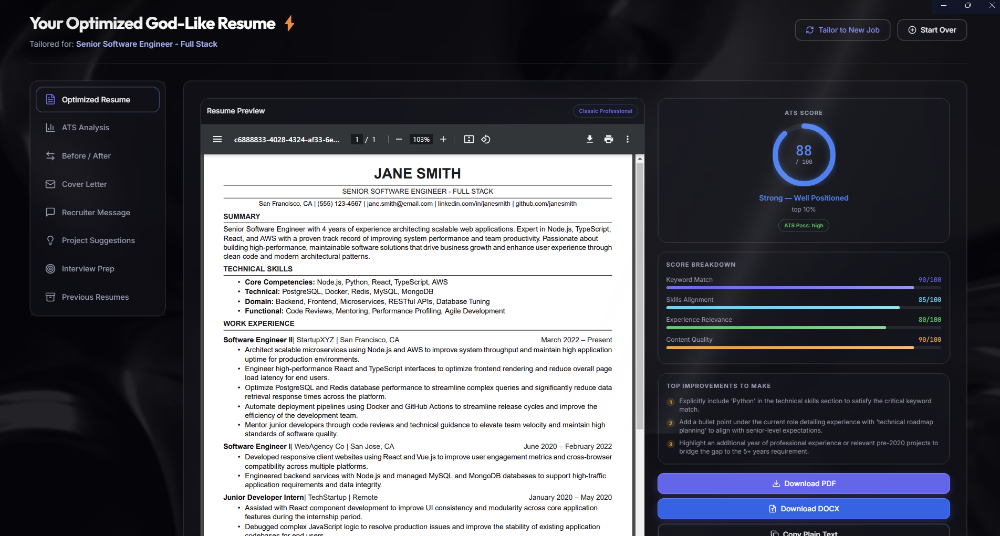

# 🚀 Raunak's ResRescue (ATS Resume Optimizer) v1.8.3


Welcome to **Raunak's ResRescue**, a next-generation desktop application designed to beat Applicant Tracking Systems (ATS) and help you land interviews. Built with a stunning liquid-glass user interface, this tool leverages the power of the Google Gemini API to analyze, restructure, and supercharge your resume against any target Job Description (JD).


## 📸 Application Showcase

Experience the seamless 5-step optimization workflow wrapped in a liquid-glass aesthetic:

| Step 1: Secure API Key | Step 2: Upload Details |
| :---: | :---: |
|  |  |

| Step 3: Choose Template | Step 4: AI Processing |
| :---: | :---: |
|  |  |

### Step 5: Optimization Results & Instant Export


## ✨ Core Features

*   **🕵️‍♂️ JobSpy Auto-Search**: Don't have a specific JD yet? Use the built-in JobSpy web scraper to find highly-relevant, remote-only, or easy-apply jobs directly from LinkedIn, Indeed, Glassdoor, and ZipRecruiter from within the app.
*   **📊 Deep ATS Analysis**: Get a brutal, honest ATS score out of 100. Uncover hidden requirements, identify "hard gaps" vs "soft gaps", and see exactly which Tier-1 keywords your resume is missing.
*   **🔄 AI-Powered Resume Rewrite**: Automatically rewrite your bullet points to match the JD's exact phrasing. Uses aggressive structural rewriting (extracting action/tool/outcome) to rebuild bullets from scratch without fabricating experience. Includes a side-by-side "Before & After" diff viewer.
*   **👑 Intelligent God Mode Titles**: Dynamically bridges the gap between your real past job titles and the target JD title, maximizing ATS relevance while remaining truthful.
*   **🛡️ Strict Project Preservation**: Never lose your hard-earned technical details. The AI is strictly constrained to preserve original impact metrics and prevent generic one-line summaries.
*   **🎨 Multi-Template Exports**: Generate production-ready resumes instantly. Export to both **PDF** and **DOCX** formats using 5 distinct templates (Classic, Modern, Executive, Creative, and Tech).
*   **✉️ Cover Letter (PDF) & Recruiter Emails**: Instantly generate targeted cover letters (now downloadable as beautifully formatted PDFs) and highly-optimized "cold emails" for recruiters with concrete, professional next steps.
*   **💡 Project Suggestions**: Lacking experience? The AI acts as a Senior Tech Lead to suggest 3 highly relevant side projects (including tech stacks and strategic reasoning) to bridge the gap.
*   **🎯 Interview Prep**: Prepare for the battle. Generates behavioral, technical, and situational interview questions based specifically on your newly optimized resume.
*   **🎯 Seamless "Apply Now" Pipeline**: Auto-searched jobs track their original URL so you can instantly submit your optimized resume via the "Apply Now" button at the end.
*   **🗄️ Local History & Privacy**: Your data stays yours. Past optimizations and PDFs are saved directly to your local machine for easy access and re-downloading.

## 🏗️ How It Works

The optimization pipeline runs 6 specialized AI agents sequentially to rebuild your resume and outreach strategy:

```text
Upload PDF ──► ATS Audit ──► Gap Analysis ──► Experience Rewrite ──► Template Engine ──► PDF / DOCX
                                  │
                                  └──► Project Suggestions & Recruiter Outreach
```

| Phase | Agent / Module | What it does |
|---|---|---|
| **1 · Parse & Audit** | `atsScorer.js` | Parses the uploaded PDF, extracts current text, and brutally scores it against the Job Description. |
| **2 · Gap Analysis** | `gapAnalyzer.js` | Identifies missing Tier-1 keywords, "hard gaps" (missing skills), and "soft gaps" (poorly framed skills). |
| **3 · Rewrite** | `experienceRewriter.js` | Reframes existing bullet points to naturally integrate missing keywords without fabricating data. |
| **4 · Suggestions** | `projectSuggestions.js` | Acts as a Senior Tech Lead to suggest 3 high-impact portfolio projects to bridge your "hard gaps". |
| **5 · Outreach** | `coverLetterAgent.js` | Generates a tailored cover letter and a punchy, targeted cold email for the hiring manager. |
| **6 · Export** | `pdfGenerator.js` | Injects the optimized data into React-PDF templates to instantly render pixel-perfect resumes locally. |

## 🛠️ Technology Stack

*   **Frontend UI**: React 18, Vite, TailwindCSS (v3)
*   **Animations**: Framer Motion (Liquid Glassmorphism Design System)
*   **Desktop Framework**: Electron, electron-builder
*   **Web Scraping**: Python, JobSpy (bundled as a standalone Windows executable)
*   **Document Generation**: `@react-pdf/renderer` (PDFs), `docx` (Word Documents)
*   **AI Engine**: `@google/generative-ai` (Gemini 1.5 Pro/Flash)
*   **Icons**: Lucide React

## 🚀 Getting Started

### Prerequisites
*   Node.js (v18 or higher recommended)
*   A Google Gemini API Key (Grab one for free from Google AI Studio)

### Installation

1.  **Clone the repository**
    ```bash
    git clone https://github.com/raunakpatil/Resrescue-ats-resume-optimizer.git
    cd Resrescue-ats-resume-optimizer
    ```

2.  **Install dependencies**
    ```bash
    npm install
    ```

3.  **Run in Development Mode**
    Start both the Vite development server and the Electron wrapper:
    ```bash
    npm run dev
    ```

4.  **Build for Production**
    Compile the React app and package it into a standalone Windows `.exe` installer:
    ```bash
    npm run electron:build
    ```
    *The generated installer will be located in the `release/` directory.*

## 💎 Design Philosophy

ResRescue is built around Apple's latest Human Interface Design principles, specifically mimicking a "Liquid Glass" aesthetic. It features real-time background blurs, frosted glass panels, subtle refractions, and fluid micro-interactions, ensuring that the desktop application feels incredibly premium and native.

## 🤝 Contributing

Contributions, issues, and feature requests are always welcome! Feel free to check the issues page or submit a Pull Request. Please read our [CONTRIBUTING.md](CONTRIBUTING.md) for details on our code of conduct and the process for submitting pull requests.

## 🧪 Testing
Automated testing is currently being developed. We plan to introduce a testing framework (e.g., Vitest) to run unit tests against our core AI evaluation logic (`atsScorer.js` and `gapAnalyzer.js`) to ensure PDF parsing and scoring remains robust and trustworthy.

## ⚠️ Troubleshooting & Known Issues

If you run into issues, here are a few common gotchas:
*   **Image-based PDFs**: This tool uses `pdf-parse` to read text. Scanned resumes or image-based PDFs cannot be parsed. Please upload text-searchable PDFs.
*   **Electron Packaging / GPU Errors**: If you encounter `gpu_diag` errors or unpack issues during `npm run electron:build`, ensure you have the latest version of Node installed, and verify that `electron-builder` has permissions to write to your `release/` directory.
*   **Gemini Rate Limits**: The free tier of the Google Gemini API has rate limits. If the app stalls on Step 4, wait a minute and try again.
*   **OS Compatibility**: While `package.json` uses `--win` for `electron-builder` by default to create a `.exe`, this application is built on web technologies and is fully **cross-platform compatible** for Mac and Linux. You simply need to adjust the `electron-builder` target arguments.

A special thanks to [Mekhala Saxena](https://github.com/MekhalaSaxena97) for her extensive Testing and Quality Assurance!

## 📝 License

This project is open-source and free to use. 

---

<div align="center">
  <em>built with ❤️ by <a href="https://github.com/raunakpatil">raunakpatil</a></em>
</div>
